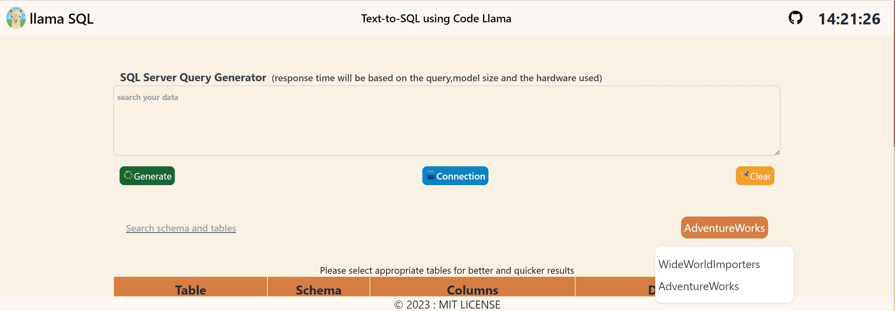
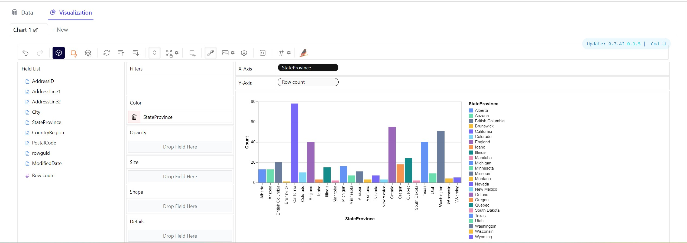

# text-to-sql

llama + SQL + PyGWalker + Flask

## Table of Contents

- [About](#about)
- [Demo](#demo)
- [Installation](#installation)
- [Change Model](#note)

## About

A personally hosted text-to-sql application that can be used to interact with your databases using natural language queries. The UI has provisions to switch between available databases, search and select tables available in the selected database, modify the SQL query generated from the Llama model and search and visualize the output as needed using PyGWalker.

The application uses **code llama 7B GGUF - 5 bit** model and can run on CPU (time taken to query the output varies depending on the hardware though).  
You can replace this model with other models more suited to your hardware.

## Demo

*Query Pages*



*Visualization Page*

  

## Installation

  
```bash

# Clone the repository
git  clone  https://github.com/raghujhts13/text-to-sql.git

# change directory to where files are present
cd text-to-sql

# install the required libraries using the requirements.txt
pip  install  -r  requirements.txt

# start the application
python app.py
```
**change the user credentials in the .env file inside the config folder**
*FLASK_KEY* = random string ( this will not affect the application )
*MODEL_PATH* = path where you have the saved model (or) where you want to install the model

You can access the application at [http://127.0.0.1:5000](http://127.0.0.1:5000/) (if this is the port where the application is running)
If you are unable to do the above, check the command prompt to fetch the URL of the flask server.

## NOTE

<u>You can change the model by altering the variable **llm_model** inside the app.py file</u>. the first argument is the **model name** and the second argument is **version/ type**(second argument is not mandatory, so you can leave it empty if you are unsure about the version)
<u>Example</u>
I have downloaded the model from [TheBloke/CodeLlama-7B-Instruct-GGUF](https://huggingface.co/TheBloke/CodeLlama-7B-Instruct-GGUF) from Hugging Face. Inside this repository I have downloaded the **codellama-7b-instruct.Q5_K_M.gguf** model. Therefore, I have used the below arguments.
```bash
# loading the model using ctransformers
llm_model  =  llm('TheBloke/CodeLlama-7B-Instruct-GGUF','codellama-7b-instruct.Q5_K_M.gguf')
```
